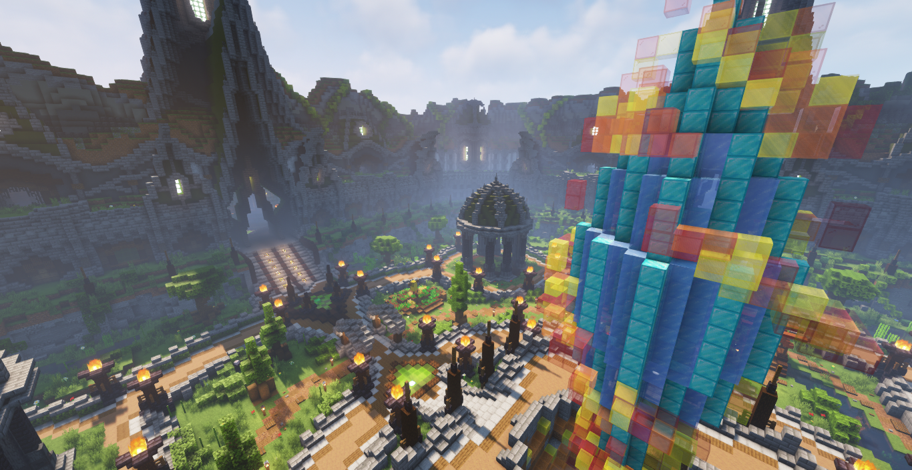

# DiamondFireWithShaders

To download an image, right click then save image as.

Example use cases:
* Background
* YouTube videos/thumbnails

### Node 1

* 
* 
* 
* 
* 
* 

### Node 2

* 
* 
* 
* 
* 

### Node 3

* 
* 
* 
* 
* 

### Node 4

* 
* 
* 
* 
* 

### Node 5

* 
* 
* 
* 
* 
* 

### Node 6

* 
* 
* 
* 
* 

### Node 7

* 
* 
* 
* 
* 
* 
* 
* 
* 
* 
* 
